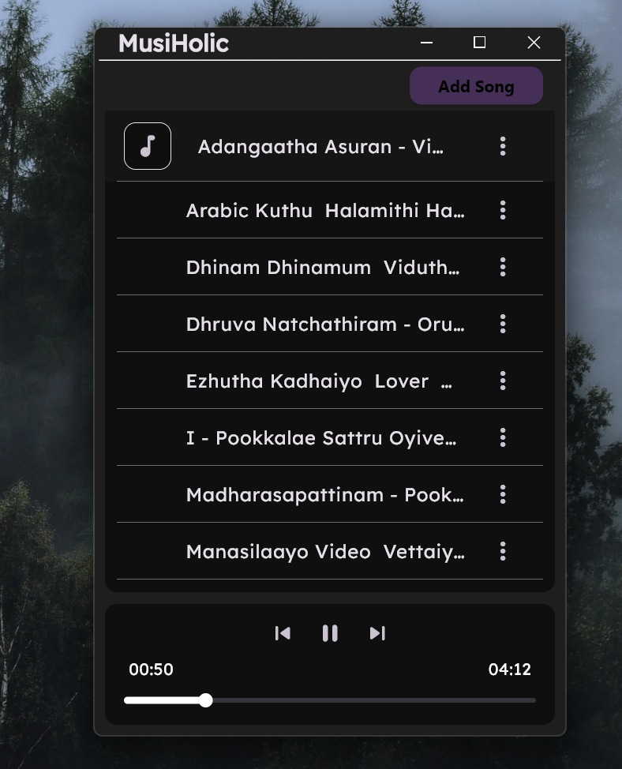

  
  MusiHolic

A minimalist music streaming app built using **Flutter** and **Supabase**. The app streams songs stored in a **Supabase bucket** with a clean interface and **Dark Mode** for an enjoyable listening experience.

## ✨ Features

- 🎧 **Stream Songs**: Play songs directly from a Supabase bucket.
- 🌙 **Dark Mode**: Enjoy a sleek, dark-themed user interface.
- 📂 **Supabase Integration**: Manage and stream songs effortlessly via Supabase storage.

## Technologies Used

- **Flutter**: Framework for building natively compiled applications for mobile, web, and desktop from a single codebase.
- **Supabase**: An open-source backend-as-a-service (BaaS) that provides a real-time database, authentication, and more.
- **Dart**: Programming language used with Flutter.

## Screenshots

### Application UI

